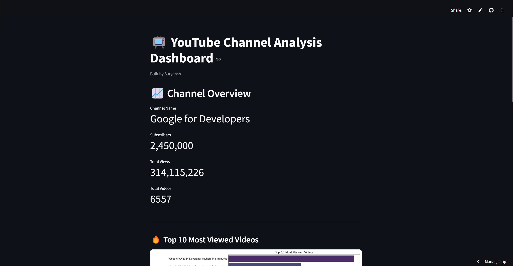
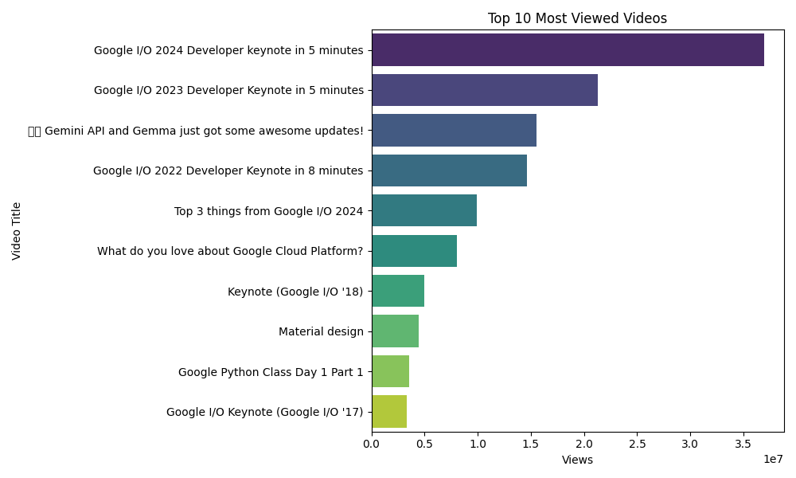

# YouTube Channel Analysis Dashboard 📺📊

A full end-to-end Data Science project where we:
- Fetched real YouTube Channel and Video data using YouTube Data API 📡
- Cleaned, analyzed, and visualized the data using Pandas, Matplotlib, and Seaborn 📈
- Built an interactive web dashboard using Streamlit 🚀

---

## 🚀 Tech Stack:
- Python 3.11
- Pandas
- Matplotlib
- Seaborn
- Streamlit
- YouTube Data API v3

---

## 📦 Project Structure:
 - /data
   - channel_stats.csv 
   - video_data.csv 
 - /output 
   - top_10_most_viewed.png 
   - monthly_upload_trend.png 
   - top_10_engagement.png 
 - /src 
   - api_extraction.py 
   - eda_analysis.py
   - dashboard.py


---

## 🎯 Features:

- 📡 Fetch YouTube Channel and Video statistics automatically
- 📊 Data Cleaning and Preprocessing
- 📈 Visualizations like:
  - Top 10 Most Viewed Videos
  - Monthly Upload Trend
  - Top 10 Videos by Engagement Ratio
- 🌐 Interactive Streamlit Dashboard
- 📂 Save visuals and insights automatically

---

## 🛠 How to Run:

1. Clone the Repository:
    ```bash
    git clone https://github.com/yourusername/youtube-channel-analysis.git
    cd youtube-channel-analysis
    ```

2. Install Requirements:
    ```bash
    pip install -r requirements.txt
    ```

3. Setup your `API_KEY` in `api_extraction.py`.

4. Run the API Data Extraction:
    ```bash
    python src/api_extraction.py
    ```

5. Run the EDA Analysis:
    ```bash
    python src/eda_analysis.py
    ```

6. Launch the Dashboard:
    ```bash
    streamlit run src/dashboard.py
    ```

---

## 📸 Sneak Peek:

| Dashboard Home | Top 10 Videos |
| :------------- | :------------ |
|  |  |

---

## 📡 Dashboard:
You can check the dashboard [here](https://yt-analysis.streamlit.app/)!

---

## 📚 Learning Outcomes:

- Working with Public APIs
- Real-world Data Cleaning and Analysis
- Building and Deploying Interactive Dashboards
- Project Structuring Best Practices

---

## ✨ Credits:
Made with ❤️ by **Suryansh Bhardwaj** during the 6-month Data Science & AI journey 🚀

---

## ⭐️ Show Your Support:
If you like this project, give it a ⭐ on GitHub and connect with me on [LinkedIn](http://www.linkedin.com/in/sbhardwaj26)!

